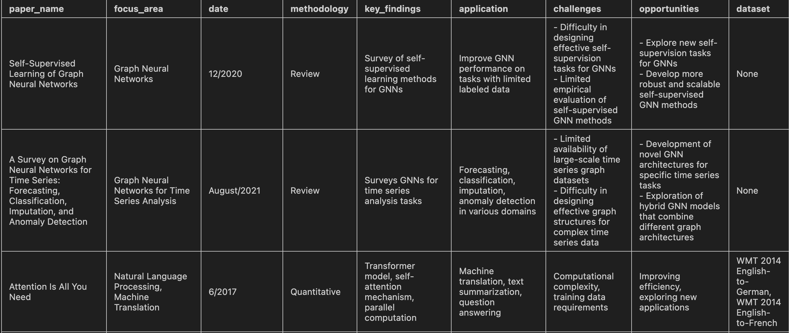

# LitRevGen

An automated workflow to generate a clean _Literature Review_ for your research projects _within seconds_.
It uses **langchain** leveraging **Google Gemini** to create **fast and accurate** literature reviews.



---

## Usage

You will `NEED` the Gemini API key for this project. Get the API key [here](https://aistudio.google.com/app/apikey)
Place it in a .env file as `GOOGLE_API_KEY` or set it in the `literature.ipynb` itself.

1. Clone The Repo

   ```bash
   git clone https://github.com/gamedevCloudy/lit-rev-gen
   cd lit-rev-gen
   ```

2. Install requirements

   ```bash
   pip install requirements.txt
   ```

3. Create a Papers Dir in the project

   ```bash
   mkdir papers
   ```

4. Put your papers in it.

5. Run the `literature.ipynb` file.
